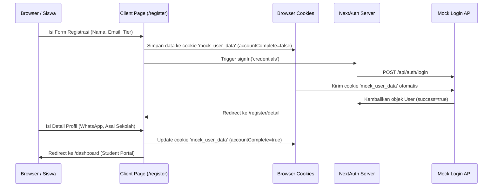

# Mekanisme Mock Autentikasi & Registrasi

Untuk kebutuhan demo presentasi tanpa mengharuskan instalasi backend database aktif (Supabase/PostgreSQL), platform menggunakan sistem mock autentikasi terpadu yang memadukan NextAuth (server-side) dan browser cookies/local storage (client-side).

## Alur Pendaftaran & Autentikasi

## Komponen Teknis

1.  **Mock API Handler (`src/app/api/auth/login/route.ts`)**:
    -   Menerima payload JSON `email` dan `password` dari NextAuth.
    -   Membaca data pendaftaran aktif dari cookie `mock_user_data`.
    -   Jika data cookie cocok, kembalikan data user dengan status `accountComplete` sesuai pendaftaran klien.
    -   Menyediakan akun default fallback untuk presentasi instan:
        -   **Email:** `student@oneacademy.id`
        -   **Password:** `password123`
        -   **Nama:** `Siswa Teladan`
        -   **Tier:** `univ`
2.  **Client-Side Cookie Synchronization (`js-cookie`)**:
    -   Menyimpan status registrasi lokal di browser agar persisten saat diakses server-side Route Handlers.
    -   Membantu melacak status lengkap pengisian formulir detail profil.
3.  **Role Redirect Middleware (`src/proxy.ts`)**:
    -   Mengatur alur navigasi bahasa dan proteksi URL.
